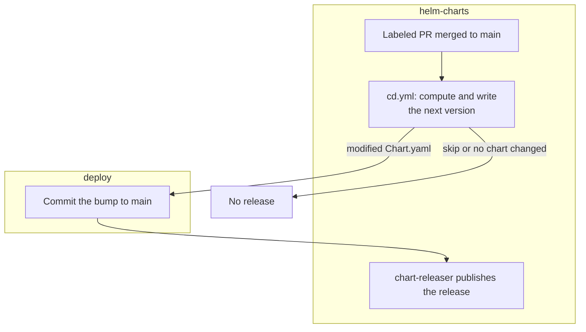

# How to Contribute

Our [Contributing Guidelines](https://contributing.bitwarden.com/contributing/) are located in our [Contributing Documentation](https://contributing.bitwarden.com/). The documentation also includes recommended tooling, code style tips, and lots of other great information to get you started.

## Versioning and Releases

### Version Labels

Pull requests should have **exactly one** version label applied. These labels determine the type of release generated and follow the principles of [Semantic Versioning (SemVer)](https://semver.org/).

| Label | Meaning | Examples |
| ------ | ------- | -------- |
| `version:major` | Breaking changes that are **not backwards compatible** and may require user action. | Removed functionality, incompatible configuration changes, breaking installer changes, API changes. |
| `version:minor` | New functionality added in a **backwards-compatible** manner. | New features, new configuration options, support for new platforms, new commands, new capabilities. |
| `version:patch` | **Backwards-compatible** fixes and maintenance improvements. | Bug fixes, security fixes, dependency updates, performance improvements, compatibility fixes. |
| `version:skip` | No release should be created. | Documentation updates, CI/CD changes, GitHub Actions/workflows, tests, refactoring with no user-visible changes, formatting, repository maintenance. |

> [!NOTE]
> Version labels follow the principles of [Semantic Versioning (SemVer)](https://semver.org/).
>
> - Apply **exactly one** version label to each pull request.
> - If a pull request introduces any **breaking change**, use `version:major`.
> - If it adds **new backwards-compatible functionality**, use `version:minor`.
> - Otherwise, use `version:patch` for **backwards-compatible fixes and maintenance**.
> - Use `version:skip` only when the pull request should **not** trigger a release.

### Release Flow

Merging a labeled pull request into `main` releases the affected chart automatically. The version is computed and written in this repository; the `deploy` repository has write access to commit it to `main`.

On merge, `cd.yml` reads the `version:*` label and determines which chart changed from the file paths. It computes the next version and writes it into that chart's `Chart.yaml`, then hands the change to `deploy`, which commits it to `main`. chart-releaser then publishes that commit as a release.

A `version:skip` label, or a pull request that touches no chart files, produces no release. A pull request that touches both charts bumps each at the label's type.



## Local Development

### Pre-Commit Hooks

This repository ships git hooks in [`.git-hooks`](.git-hooks). Enable them once with:

```bash
git config --local core.hooksPath .git-hooks
```

The pre-commit hook lints the charts with `helm lint` and regenerates `values.schema.json` for any chart whose `values.yaml` is staged. It requires [Helm](https://helm.sh/) and the [helm-schema](https://github.com/dadav/helm-schema) plugin.

### Helm Schema

Helm chart schemas are generated from `values.yaml` files, and validated by CI. You can regenerate manually, or use the pre-commit hook:

```bash
helm plugin install https://github.com/dadav/helm-schema

# From a chart directory
helm schema -k additionalProperties --skip-auto-generation required
```

### Helm Testing

Helm charts are tested using [Helm Unittest](https://github.com/helm-unittest/helm-unittest). Tests are ran automatically in CI from the chart `tests` directory, but can also be ran locally:

```bash
helm plugin install https://github.com/helm-unittest/helm-unittest

# From a chart directory
helm unittest .
```

## Claude Code Tooling

When you've identified a Claude convention worth codifying, refer to [Contributing Claude Context to This Repo](.claude/CONTRIBUTING.md) for guidance on where it belongs and how to contribute it.
